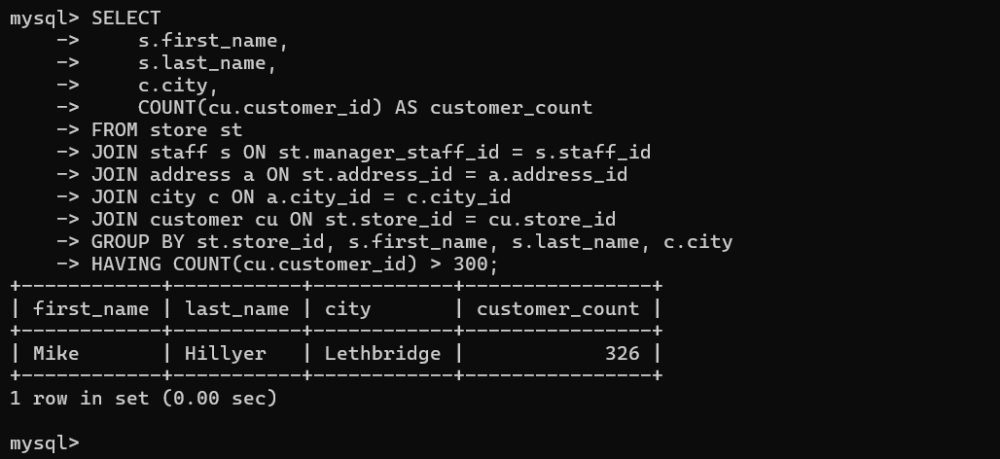
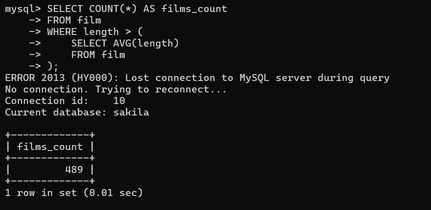
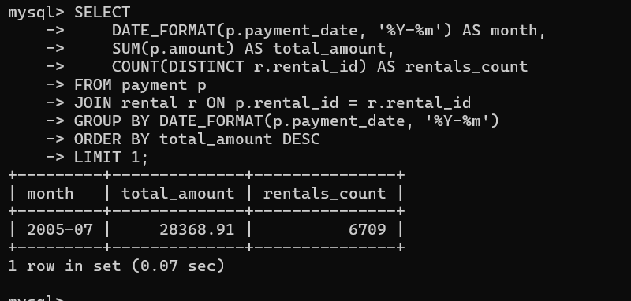

## Задание 1

```sql
SELECT
    s.first_name,
    s.last_name,
    c.city,
    COUNT(cu.customer_id) AS customer_count
FROM store st
JOIN staff s ON st.manager_staff_id = s.staff_id
JOIN address a ON st.address_id = a.address_id
JOIN city c ON a.city_id = c.city_id
JOIN customer cu ON st.store_id = cu.store_id
GROUP BY st.store_id, s.first_name, s.last_name, c.city
HAVING COUNT(cu.customer_id) > 300;
```



## Задание 2

```sql
SELECT COUNT(*) AS films_count
FROM film
WHERE length > (
    SELECT AVG(length)
    FROM film
);
```



## Задание 3

```sql
SELECT
    DATE_FORMAT(p.payment_date, '%Y-%m') AS month,
    SUM(p.amount) AS total_amount,
    COUNT(DISTINCT r.rental_id) AS rentals_count
FROM payment p
JOIN rental r ON p.rental_id = r.rental_id
GROUP BY DATE_FORMAT(p.payment_date, '%Y-%m')
ORDER BY total_amount DESC
LIMIT 1;
```


